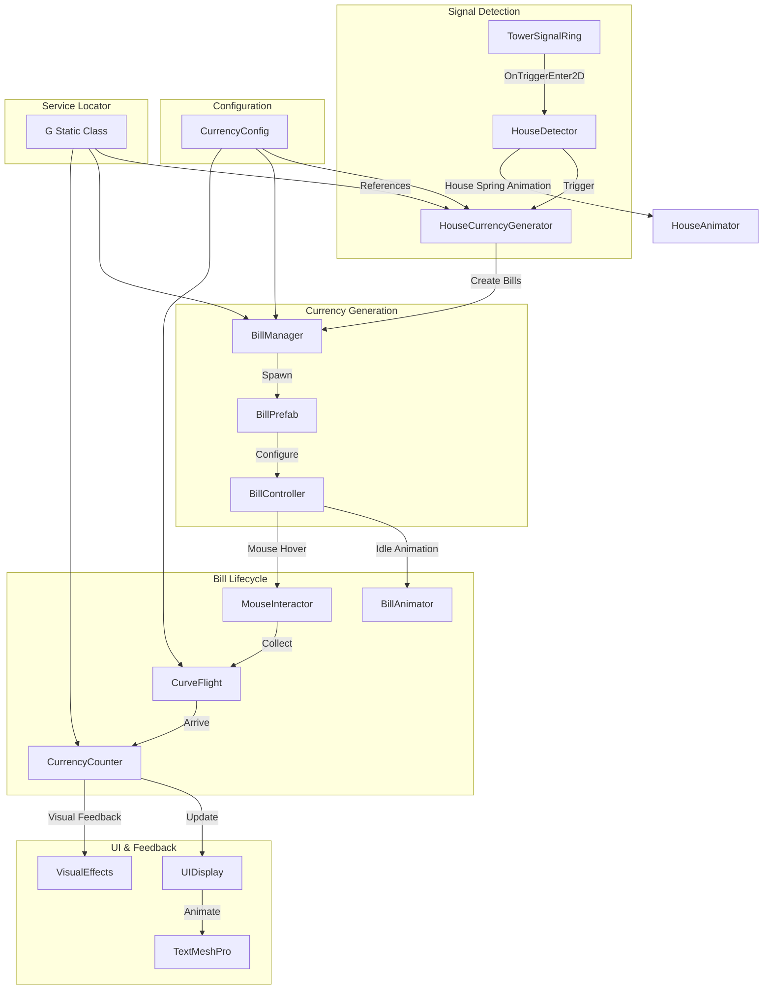

# Currency Generation System Architecture

## Overview
This document outlines the architecture for a currency generation system in a Unity game where houses generate bills when a signal ring passes through them. The system follows SOLID principles, uses ScriptableObjects for configuration, integrates with the existing 'G' service locator pattern, and ensures zero allocations in execution loops.

## System Architecture Diagram



## Key Classes and Responsibilities

### 1. HouseCurrencyGenerator
**Location:** `Assets/_Project/Scripts/Currency/HouseCurrencyGenerator.cs`
**Responsibility:** Attached to each house prefab. Listens for signal ring collisions, triggers house animation, and requests bill generation.
- Detects `OnTriggerEnter2D` from `TowerSignalRing`
- Plays house spring animation using DOTween
- Calls `BillManager.Instance.GenerateBills()` with house position and config
- Self-registers with house tracking system if needed

### 2. BillManager
**Location:** `Assets/_Project/Scripts/Currency/BillManager.cs`
**Responsibility:** Central orchestrator for bill lifecycle management. Uses object pooling for performance.
- Manages `ObjectPool<BillController>` for bill prefabs
- Generates bills based on `CurrencyConfig` (count, value ranges)
- Handles bill spawning, recycling, and cleanup
- Self-registers as `G.BillManager`
- Provides API for bill collection and flight initiation

### 3. BillController
**Location:** `Assets/_Project/Scripts/Currency/BillController.cs`
**Responsibility:** MonoBehaviour attached to each bill prefab. Manages bill state, animations, and interactions.
- States: `Idle`, `Hovered`, `Flying`, `Collected`
- Handles mouse hover detection via `OnMouseEnter` or raycasting
- Manages pulsating/flickering animation using DOTween sequences
- Initiates curve flight to currency counter when hovered
- Self-destructs or returns to pool after collection

### 4. CurrencyCounter
**Location:** `Assets/_Project/Scripts/Currency/CurrencyCounter.cs`
**Responsibility:** Tracks total currency, handles smooth increment animations, and provides UI updates.
- Maintains `currentAmount` and `displayAmount`
- Uses DOTween for smooth value interpolation (1-3 seconds based on amount)
- Coordinates with `UIManager` for UI updates
- Triggers visual feedback (pulse) on bill arrival
- Self-registers as `G.Currency`

### 5. CurrencyConfig (ScriptableObject)
**Location:** `Assets/_Project/Scripts/Currency/Config/CurrencyConfig.cs`
**Responsibility:** Central configuration for currency generation parameters.
- Bill count range (min/max)
- Bill value range (min/max)
- Flight curve parameters (height, duration, ease)
- Animation settings (pulse speed, flicker intensity)
- Visual settings (bill prefab reference, sprite variants)

### 6. CurveFlight
**Location:** `Assets/_Project/Scripts/Currency/CurveFlight.cs`
**Responsibility:** Handles parabolic/curved flight path from bill position to UI counter.
- Calculates Bézier curve with configurable control point
- Uses DOTween for smooth animation with rotation
- Handles multiple simultaneous flights with queueing
- Calls `CurrencyCounter.AddCurrency()` on arrival

### 7. BillAnimator
**Location:** `Assets/_Project/Scripts/Currency/BillAnimator.cs`
**Responsibility:** Dedicated animation controller for bill visual effects.
- Pulsating scale animation (DOTween sequence)
- Light2D intensity flickering (randomized within range)
- Rotation wobble during flight
- Pooled animation sequences to avoid allocations

### 8. HouseAnimator
**Location:** `Assets/_Project/Scripts/Currency/HouseAnimator.cs`
**Responsibility:** Handles house spring animation when generating currency.
- Quick scale-up then settle bounce (DOTween)
- Optional particle effect for visual feedback
- Attached to house prefab alongside `HouseCurrencyGenerator`

## ScriptableObject Configurations

### 1. CurrencyConfig.asset
**Path:** `Assets/_Project/Configs/CurrencyConfig.asset`
**Properties:**
```csharp
[Header("Generation")]
[SerializeField] private Vector2Int _billCountRange = new Vector2Int(1, 3);
[SerializeField] private Vector2Int _billValueRange = new Vector2Int(10, 100);

[Header("Flight")]
[SerializeField] private float _flightDuration = 0.8f;
[SerializeField] private float _flightHeight = 2f;
[SerializeField] private AnimationCurve _flightCurve = AnimationCurve.EaseInOut(0, 0, 1, 1);

[Header("Visuals")]
[SerializeField] private GameObject _billPrefab;
[SerializeField] private Sprite[] _billSprites;
[SerializeField] private float _pulseScale = 1.1f;
[SerializeField] private float _pulseDuration = 0.5f;

[Header("Light2D")]
[SerializeField] private float _minLightIntensity = 0.7f;
[SerializeField] private float _maxLightIntensity = 1.3f;
[SerializeField] private float _flickerSpeed = 3f;
```

### 2. Integration with Existing Configs
- Extend `HouseConfig` with optional currency generation modifiers
- Add `CurrencyConfig` reference to `GameConfig` for global access

## Prefab Structure

### Bill Prefab (`Assets/_Project/Prefabs/Currency/Bill.prefab`)
```
Bill (GameObject)
├── SpriteRenderer (Bill sprite, sorting layer: UI)
├── CircleCollider2D (Trigger, radius larger than sprite)
├── Light2D (Point light for glow effect)
├── BillController (MonoBehaviour)
└── BillAnimator (MonoBehaviour)
```

### House Prefab Modifications
Existing house prefabs will have:
- `HouseCurrencyGenerator` component
- `HouseAnimator` component  
- `CircleCollider2D` (trigger) for signal detection

## Animation and Visual Effects Plan

### 1. House Spring Animation
- **Trigger:** Signal ring collision
- **Effect:** Quick scale up to 1.1x, then bounce back with overshoot
- **Duration:** 0.3 seconds total
- **Implementation:** `DOTween.Sequence()` with `SetEase(Ease.OutBack)`

### 2. Bill Idle Animation
- **Pulsating Scale:** Sine wave between 1.0 and 1.05 scale
- **Light Flicker:** `Light2D.intensity` randomized between min/max
- **Rotation:** Slight random rotation (±5 degrees) over time
- **Performance:** Use shared `DOTween` sequences cached in `BillAnimator`

### 3. Bill Flight Animation
- **Curved Path:** Quadratic Bézier with control point above midpoint
- **Rotation:** Bill rotates to face direction of movement
- **Scale:** Slight shrink as it approaches destination
- **Easing:** `Ease.InOutCubic` for smooth acceleration/deceleration

### 4. UI Feedback
- **Counter Increment:** Smooth numeric interpolation with comma formatting
- **Icon Pulse:** Bill icon scales up briefly on each collection
- **Screen Shake:** Optional subtle shake for large amounts
- **Sound:** Integration with existing `AudioManager`

## Integration with Existing Systems

### 1. 'G' Service Locator Integration
Add to `G.cs`:
```csharp
public static BillManager BillManager { get; set; }
public static CurrencyCounter Currency { get; set; }
public static CurrencyConfig CurrencyConfig { get; set; }
```

**Registration Pattern:**
- `BillManager` registers in `Awake()`: `G.BillManager = this`
- `CurrencyCounter` registers in `Awake()`: `G.Currency = this`
- `CurrencyConfig` self-registers in `OnEnable()` (like `HouseConfig`)

### 2. Integration with TowerSignalRing
Modify `TowerSignalRing.cs` to:
- Keep existing collision detection
- No changes needed - houses detect the ring via `OnTriggerEnter2D`

### 3. Integration with UIManager
Extend `UIManager.cs` to:
- Add currency display panel reference
- Provide method `UpdateCurrencyDisplay(int amount)`
- Coordinate with `CurrencyCounter` for visual updates

### 4. Integration with ObjectPool
Use existing `ObjectPool` system (`G.Pool`):
- Pre-warm bill pool on game start
- Implement `IPoolable` interface in `BillController`
- Recycle bills instead of Instantiate/Destroy

## Performance Considerations

### 1. Zero Allocations in Update Loops
- **Cache References:** All `GetComponent<>()` calls in `Awake()`
- **Reuse DOTween Sequences:** Create once, restart instead of recreate
- **Object Pooling:** All bill instances from pool, no `Instantiate` during gameplay
- **Event Delegates:** Use static delegates or C# events with pooled listeners

### 2. Optimized Collision Detection
- Use `CompareTag()` instead of `gameObject.tag ==`
- Layer-based filtering: Houses on "House" layer, signal ring on "Signal" layer
- Simple `CircleCollider2D` triggers (no complex polygons)

### 3. Animation Performance
- Use `DOTween`'s `SetUpdate(true)` for independent time scale
- Limit simultaneous animations (max 10-15 bills flying)
- Use `MaterialPropertyBlock` for sprite color changes instead of new materials

### 4. Memory Management
- **Bill Pool Size:** Configurable (default 20), expandable as needed
- **No LINQ in loops:** Use `for` loops with cached array lengths
- **String Building:** Use `StringBuilder` for currency formatting
- **Coroutine Alternative:** Use `async/await` with `UniTask` (already in project)

## Implementation Roadmap

### Phase 1: Foundation (Core Systems)
1. Create `CurrencyConfig` ScriptableObject
2. Implement `BillManager` with object pooling
3. Create `BillController` with basic state machine
4. Implement `CurrencyCounter` with smooth increment

### Phase 2: Visuals & Animation
1. Design bill prefab with sprite and Light2D
2. Implement `BillAnimator` for pulsating/flickering
3. Create `CurveFlight` for collection animation
4. Add house spring animation (`HouseAnimator`)

### Phase 3: Integration
1. Modify house prefabs with `HouseCurrencyGenerator`
2. Integrate with `G` service locator
3. Connect to existing `UIManager` for display
4. Add audio feedback via `AudioManager`

### Phase 4: Polish & Optimization
1. Tune animation curves and timing
2. Implement performance profiling
3. Add visual effects (particles, screen shake)
4. Create editor tools for configuration

## File Structure
```
Assets/_Project/Scripts/Currency/
├── BillController.cs
├── BillManager.cs
├── CurrencyCounter.cs
├── CurveFlight.cs
├── HouseCurrencyGenerator.cs
├── HouseAnimator.cs
├── BillAnimator.cs
├── Config/
│   └── CurrencyConfig.cs
└── Editor/
    └── CurrencyConfigEditor.cs (optional)
```

Assets/_Project/Prefabs/Currency/
└── Bill.prefab

Assets/_Project/Configs/
└── CurrencyConfig.asset

Assets/_Project/Sprites/UI/
└── (add bill sprite variants)
```

## Dependencies
- **DOTween:** Already in project via Demigiant package
- **TextMesh Pro:** Already configured
- **Unity 2D Lights:** Requires Light2D package (URP 2D)
- **UniTask:** Assumed available for async operations

## Testing Considerations
- Unit tests for `CurrencyCounter` increment logic
- Integration test for bill generation on signal collision
- Performance test with 50+ simultaneous bills
- Edge cases: rapid signal rings, overlapping collections