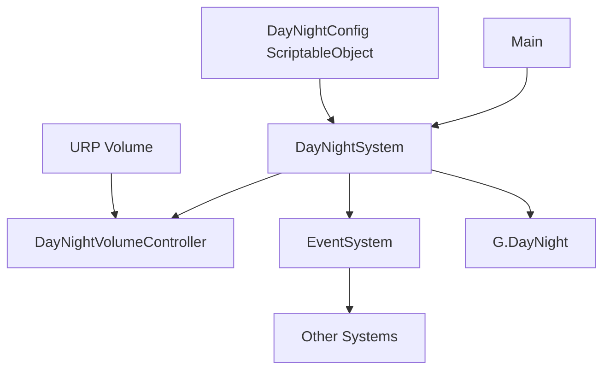

# Day/Night Cycle System Architecture

## Overview
A URP-based day/night cycle system for Unity that provides:
- Real-time time progression with configurable speed
- URP post-processing visual effects (color grading, exposure, etc.)
- Event-driven integration for other game systems
- Zero‑allocation performance in update loops
- Full adherence to project architectural patterns (G class, ScriptableObjects, EventSystem)

## System Components



### 1. Time Management System (`DayNightSystem`)
**Responsibilities**:
- Track in‑game time (normalized 0‑1 and 24‑hour representation)
- Advance time based on real‑time delta (respects game pause)
- Trigger time‑change events
- Detect day‑end wrap‑around and fire `DayEndEvent`
- Provide public API for querying time, pausing, speeding up, etc.

**Key Properties**:
- `CurrentTimeNormalized` (float 0‑1)
- `CurrentHour` (float 0‑24)
- `IsPaused` (bool)
- `TimeScale` (float multiplier)

**Performance**:
- Caches all references in `Awake`
- Zero allocations in `Update` (no new objects, no LINQ, no string operations)
- Uses pre‑allocated event objects for recycling

### 2. Configuration ScriptableObject (`DayNightConfig`)
**Location**: `Assets/_Project/Scripts/Data/Configs/DayNightConfig.cs`

**Fields**:
```csharp
[SerializeField] private float _dayLengthSeconds = 300f; // Real‑time seconds per full cycle
[SerializeField] private float _startTimeNormalized = 0.25f; // Dawn
[SerializeField] private bool _autoStart = true;
[SerializeField] private AnimationCurve _exposureCurve = AnimationCurve.Linear(0, 1, 1, 0);
[SerializeField] private AnimationCurve _temperatureCurve = AnimationCurve.Linear(0, 8000, 1, 2000);
[SerializeField] private AnimationCurve _tintCurve = AnimationCurve.Linear(0, 0, 1, 0);
[SerializeField] private AnimationCurve _saturationCurve = AnimationCurve.Linear(0, 1, 1, 0.8);
[SerializeField] private Gradient _skyTintGradient; // For possible skybox/light color
```

**Self‑Registration**:
- Registers itself as `G.DayNightConfig` in `OnEnable`
- Follows same pattern as `GameConfig` and `HouseConfig`

### 3. URP Visual Effects Controller (`DayNightVolumeController`)
**Responsibilities**:
- Locates the active URP `Volume` (global or camera‑specific)
- Applies post‑processing overrides based on current time and config curves
- Caches `Volume` and `VolumeProfile` components for zero‑allocation updates
- Supports blending between multiple volume profiles if needed

**Implementation Details**:
- Uses `Volume` overrides: `ColorAdjustments`, `WhiteBalance`, `Exposure`
- Updates only when time changes beyond a threshold (e.g., 0.001) to reduce CPU load
- Can be disabled if visual effects are not required

### 4. Event Definitions
**Location**: `Assets/_Project/Scripts/Core/Events/DayNightEvents.cs`

```csharp
public class DayNightTimeChangedEvent
{
    public float NormalizedTime { get; }
    public float Hour { get; }
    // Constructor...
}

public class DayEndEvent
{
    public int DayCount { get; }
    // Constructor...
}

public class DayPhaseChangedEvent
{
    public enum Phase { Dawn, Day, Dusk, Night }
    public Phase NewPhase { get; }
    // Constructor...
}
```

**Integration with Existing EventSystem**:
- `DayNightSystem` subscribes to `GameState` changes to pause/resume
- Other systems can subscribe to `DayEndEvent` for end‑of‑day logic
- Clock UI can listen to `DayNightTimeChangedEvent` (throttled) for updates

### 5. G Class Integration
**Extensions to `G.cs`**:
```csharp
public static class G
{
    // Existing properties...
    public static DayNightSystem DayNight { get; set; }
    public static DayNightConfig DayNightConfig { get; set; }
    
    // Helper methods...
    public static bool HasDayNight() => DayNight != null;
    public static bool HasDayNightConfig() => DayNightConfig != null;
}
```

**Self‑Registration Pattern**:
- `DayNightSystem` registers itself in `Awake`
- `DayNightConfig` registers itself in `OnEnable`
- Both unregister in `OnDestroy`/`OnDisable`

### 6. Folder Structure
```
Assets/_Project/Scripts/
├── Core/
│   ├── DayNightSystem.cs
│   └── Events/
│       └── DayNightEvents.cs
├── Data/
│   └── Configs/
│       └── DayNightConfig.cs
├── Graphics/
│   └── DayNightVolumeController.cs
└── Utilities/ (existing)
```

### 7. URP Implementation Approach
**Volume Setup**:
1. Ensure a `Global Volume` exists in the scene with a `Volume` component.
2. Add post‑processing overrides: `Color Adjustments`, `White Balance`, `Exposure`.
3. `DayNightVolumeController` will override these parameters at runtime.

**Shader Graph Considerations**:
- If custom shaders are needed for day/night lighting, create a `DayNightShaderController` that adjusts material properties.
- Use `Shader.SetGlobalFloat` for time‑based parameters (e.g., `_DayNightFactor`).

**Performance**:
- Volume overrides are cheap; avoid enabling expensive effects (Bloom, Depth of Field) unless needed.
- Use `[ExecuteAlways]` for editor preview but disable in builds.

### 8. Integration with Existing Systems
**Main Game Loop**:
- `DayNightSystem` updates only when `GameState == Playing`
- `Main` can inject time‑scale modifiers based on gameplay events

**Clock Sprite Display**:
- A `ClockUI` component can read `G.DayNight.CurrentHour` and rotate a sprite accordingly.
- Subscribe to `DayNightTimeChangedEvent` for smooth updates.

**NPC Routines**:
- NPC systems can subscribe to `DayPhaseChangedEvent` to change behavior.

**Save System**:
- `DayNightSystem` provides `SaveData` with current time and day count.
- `SaveSystem` serializes this data.

### 9. Implementation Steps
1. Create `DayNightConfig` ScriptableObject with curves.
2. Implement `DayNightSystem` core time tracking.
3. Implement `DayNightVolumeController` for URP effects.
4. Define events and integrate with `EventSystem`.
5. Extend `G` class with new properties.
6. Create a prefab with `DayNightSystem` and `DayNightVolumeController` components.
7. Add prefab to the startup scene.
8. Test with a sample clock UI.

### 10. Constraints Adherence
- **SOLID**: Each class has single responsibility, open for extension.
- **Zero Allocations**: No `new` in `Update`, cached delegates, reused event objects.
- **ScriptableObject Configuration**: All tunable parameters in `DayNightConfig`.
- **G Class**: Global access via `G.DayNight` and `G.DayNightConfig`.
- **EventSystem**: Decoupled communication via existing `EventSystem`.
- **URP**: Uses URP's `Volume` system, compatible with 2D/3D.

## Deliverables Summary
1. **Architecture**: Component diagram and responsibility breakdown.
2. **Class Structure**: Namespaces, interfaces, and method signatures.
3. **Configuration**: `DayNightConfig` ScriptableObject design.
4. **Integration Plan**: How the system connects to `G`, `EventSystem`, `Main`.
5. **URP Implementation**: Volume profiles, shader graphs, performance considerations.

This design is ready for implementation in the next coding phase.