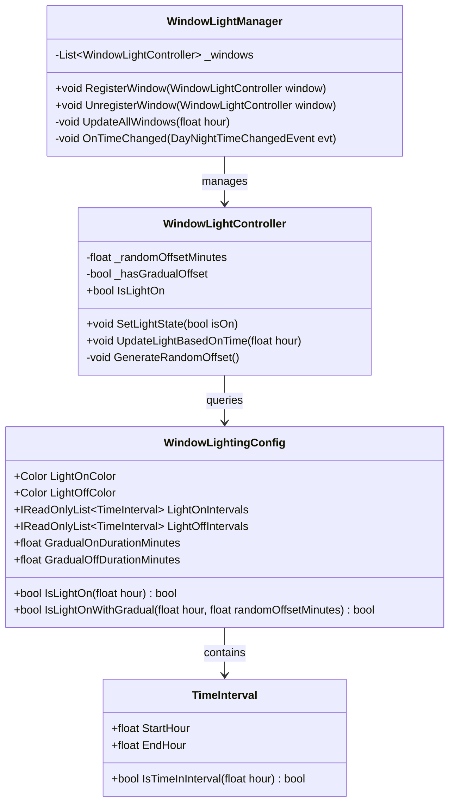
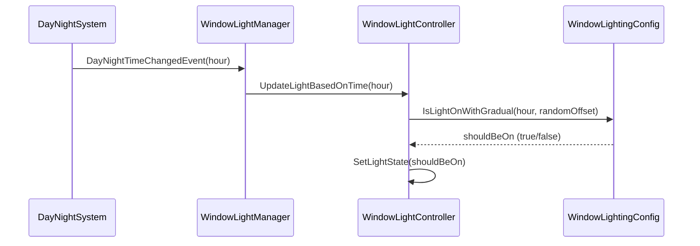

# Gradual Window Lighting Enhancement Architecture

## 1. Overview

This document outlines the architectural design for enhancing the existing window lighting system to support gradual (staggered) lighting instead of all windows turning on/off simultaneously. The enhancement maintains backward compatibility and follows the project's established patterns (G service locator, zero allocations, UniTask for async).

## 2. Current System Analysis

### 2.1 Components

1. **WindowLightingConfig** (`Assets/_Project/Scripts/HouseGenerator/Config/WindowLightingConfig.cs`)
   - Stores ON/OFF time intervals and colors
   - Provides `IsLightOn(float hour)` method for immediate state determination
   - Uses `TimeInterval` struct for interval representation

2. **WindowLightController** (`Assets/_Project/Scripts/Effects/WindowLightController.cs`)
   - Controls visual state of individual window (SpriteRenderer + Light2D)
   - Registers with WindowLightManager on enable
   - Implements `UpdateLightBasedOnTime(float hour)` called by manager

3. **WindowLightManager** (`Assets/_Project/Scripts/Effects/WindowLightManager.cs`)
   - Central coordinator for all window lighting
   - Subscribes to `DayNightTimeChangedEvent`
   - Maintains list of registered windows and updates them on time changes
   - Self-registers with `G.WindowLightManager`

4. **TimeInterval** (`Assets/_Project/Scripts/HouseGenerator/Config/TimeInterval.cs`)
   - Represents a time interval with start/end hours (0-24)
   - Handles intervals crossing midnight

### 2.2 Current Behavior
- When time reaches an ON interval (e.g., 18:00-20:00), all windows turn ON immediately
- When time reaches an OFF interval (e.g., 00:00-02:00), all windows turn OFF immediately
- OFF intervals take precedence over ON intervals
- Updates occur on time change events with configurable threshold

## 3. Requirements for Gradual Lighting

### 3.1 Functional Requirements
1. Windows should turn ON gradually during ON intervals (e.g., over 30 minutes from 18:00 to 18:30)
2. Windows should turn OFF gradually during OFF intervals (e.g., over 30 minutes from 00:00 to 00:30)
3. Each window should have a random delay within the gradual period
4. The system must maintain backward compatibility (existing behavior if gradual timing is not configured)
5. Zero allocations in Update loops must be preserved
6. Must work with existing G service locator pattern
7. Should not break existing window prefabs

### 3.2 Non-Functional Requirements
1. Performance: Support hundreds of windows without frame drops
2. Determinism: Same window should turn on/off at same time each day
3. Configurability: Gradual duration should be configurable per interval type (ON/OFF)
4. Extensibility: Design should allow per-interval gradual durations in future

## 4. Proposed Architecture

### 4.1 High-Level Design

The enhancement extends existing components with minimal changes:

1. **WindowLightingConfig**: Add gradual duration fields
2. **WindowLightController**: Add deterministic random offset and enhanced state calculation
3. **WindowLightManager**: No structural changes needed (still batches updates)
4. **TimeInterval**: No changes (gradual duration applied globally per interval type)

### 4.2 Component Modifications

#### 4.2.1 WindowLightingConfig Extensions

```csharp
[Header("Gradual Lighting")]
[SerializeField, Tooltip("Duration in minutes over which windows gradually turn ON (0 = immediate).")]
private float _gradualOnDurationMinutes = 0f;

[SerializeField, Tooltip("Duration in minutes over which windows gradually turn OFF (0 = immediate).")]
private float _gradualOffDurationMinutes = 0f;

public float GradualOnDurationMinutes => _gradualOnDurationMinutes;
public float GradualOffDurationMinutes => _gradualOffDurationMinutes;

// New method for gradual state calculation
public bool IsLightOnWithGradual(float currentHour, float randomOffsetMinutes)
{
    // Implementation detailed in Section 5
}
```

**Backward Compatibility**: When both durations are 0, the system behaves identically to current implementation.

#### 4.2.2 WindowLightController Extensions

```csharp
// New fields
private float _randomOffsetMinutes; // 0 <= offset < gradual duration
private bool _hasGradualOffset = false;

// Modified Awake() to generate deterministic offset
private void Awake()
{
    CacheComponentReferences();
    CacheColorsFromConfig();
    
    // Generate deterministic random offset based on instance ID and position
    GenerateRandomOffset();
    
    ApplyVisualState(_isLightOn);
}

private void GenerateRandomOffset()
{
    if (!G.HasHouseConfig()) return;
    
    var config = G.HouseConfig.WindowLightingConfig;
    float maxDuration = Mathf.Max(config.GradualOnDurationMinutes, config.GradualOffDurationMinutes);
    
    if (maxDuration <= 0f)
    {
        _hasGradualOffset = false;
        return;
    }
    
    // Deterministic hash from instance ID and position
    int hash = GetInstanceID() ^ transform.position.GetHashCode();
    _randomOffsetMinutes = (hash % 1000) / 1000f * maxDuration; // 0 to maxDuration
    _hasGradualOffset = true;
}

// Enhanced UpdateLightBasedOnTime
public void UpdateLightBasedOnTime(float currentHour)
{
    if (!G.HasHouseConfig())
    {
        Debug.LogWarning($"[WindowLightController] HouseConfig not available.", this);
        return;
    }

    WindowLightingConfig config = G.HouseConfig.WindowLightingConfig;
    bool shouldBeOn;
    
    if (_hasGradualOffset && (config.GradualOnDurationMinutes > 0f || config.GradualOffDurationMinutes > 0f))
    {
        shouldBeOn = config.IsLightOnWithGradual(currentHour, _randomOffsetMinutes);
    }
    else
    {
        shouldBeOn = config.IsLightOn(currentHour); // Fallback to original
    }
    
    SetLightState(shouldBeOn);
}
```

#### 4.2.3 WindowLightManager Modifications

No structural changes required. The manager continues to call `UpdateLightBasedOnTime` on each window. Each window computes its own state using its random offset.

**Performance Consideration**: The manager's batch update loop remains allocation-free. The additional per-window calculation is minimal (O(number of intervals)).

### 4.3 Gradual Timing Algorithm

#### 4.3.1 Algorithm Design

The core algorithm determines if a window should be ON at a given hour, considering:
- Multiple ON/OFF intervals
- Gradual durations for each interval type
- Window-specific random offset within gradual period
- OFF interval precedence

**Key Concepts**:
- **Gradual Period**: The time window `[intervalStart, intervalStart + gradualDurationHours)` during which windows turn on/off randomly.
- **Random Offset**: Each window has a fixed offset `R` (0 ≤ R < gradualDuration) determining when it switches during the gradual period.
- **Transition Time**: For a given interval, window switches at `intervalStart + R/60` hours.

#### 4.3.2 Algorithm Steps

For a given hour `h`, random offset `R` (in hours = `randomOffsetMinutes/60`):

1. **Check OFF intervals** (precedence):
   For each OFF interval `[startOff, endOff]`:
   - If `h` is within interval (considering midnight wrap):
     - Compute `transitionEnd = startOff + gradualOffDurationHours`
     - If `h < startOff + R` → window not yet turned OFF (still ON)
     - Else → window is OFF
     - Return OFF if determined
   - If `h` is after transitionEnd but within interval → OFF
   - If `h` is before startOff → no effect

2. **Check ON intervals** (if no OFF interval forces OFF):
   For each ON interval `[startOn, endOn]`:
   - Similar logic but for turning ON

3. **Default**: OFF

#### 4.3.3 Implementation Details

```csharp
public bool IsLightOnWithGradual(float currentHour, float randomOffsetMinutes)
{
    float randomOffsetHours = randomOffsetMinutes / 60f;
    
    // First, check OFF intervals
    foreach (var interval in _lightOffIntervals)
    {
        if (!interval.IsTimeInInterval(currentHour))
            continue;
            
        float start = interval.StartHour;
        float gradualHours = _gradualOffDurationMinutes / 60f;
        
        if (gradualHours <= 0f)
        {
            // Immediate OFF
            return false;
        }
        
        float transitionEnd = start + gradualHours;
        
        // Check if we're in the gradual period
        if (currentHour >= start && currentHour < transitionEnd)
        {
            // Window turns OFF at start + randomOffsetHours
            if (currentHour >= start + randomOffsetHours)
                return false;
            // Otherwise, still ON (hasn't reached its turn-off time yet)
        }
        else
        {
            // Past gradual period, definitely OFF
            return false;
        }
    }
    
    // Check ON intervals (only if no OFF interval forced OFF)
    foreach (var interval in _lightOnIntervals)
    {
        if (!interval.IsTimeInInterval(currentHour))
            continue;
            
        float start = interval.StartHour;
        float gradualHours = _gradualOnDurationMinutes / 60f;
        
        if (gradualHours <= 0f)
        {
            // Immediate ON
            return true;
        }
        
        float transitionEnd = start + gradualHours;
        
        if (currentHour >= start && currentHour < transitionEnd)
        {
            // Window turns ON at start + randomOffsetHours
            if (currentHour >= start + randomOffsetHours)
                return true;
            // Otherwise, still OFF
        }
        else
        {
            // Past gradual period, definitely ON
            return true;
        }
    }
    
    // No interval matches
    return false;
}
```

**Edge Cases**:
- Intervals crossing midnight: `IsTimeInInterval` already handles this.
- Overlapping intervals: OFF takes precedence as per original logic.
- Multiple intervals of same type: First matching interval determines state.
- Random offset larger than gradual duration: Clamp to `[0, gradualDuration)`.

### 4.4 Performance Considerations

1. **Zero Allocations**: 
   - No LINQ, no closures, no string concatenation in update loops
   - Random offset generated once per window (cached)
   - List iterations use for loops with cached counts

2. **Calculation Complexity**:
   - Each window evaluates all intervals (O(N × M) where N = windows, M = intervals)
   - Typical scenario: < 100 windows, < 5 intervals → negligible
   - Optimization: Precompute active interval per hour across all windows (shared in manager)

3. **Memory**:
   - Each WindowLightController adds 8 bytes (float + bool)
   - WindowLightingConfig adds 8 bytes (two floats)

4. **Async Operations**:
   - No coroutines needed (state changes are immediate but time-delayed)
   - UniTask not required for basic functionality but could be used for smooth fading in future

### 4.5 Backward Compatibility Strategy

1. **Default Values**: Gradual durations default to 0, resulting in immediate switching (identical to current behavior).
2. **Fallback Path**: If gradual durations are 0 or config unavailable, use original `IsLightOn` method.
3. **Serialization**: New fields are serialized with default values, existing assets remain valid.
4. **Prefab Compatibility**: No changes to prefab structure; existing WindowLightController components work without modification.

### 4.6 Extension Points

1. **Per-Interval Gradual Durations**: Future enhancement by adding gradual duration fields to `TimeInterval` struct.
2. **Smooth Intensity Fading**: Could extend `WindowLightController` to interpolate light intensity over time.
3. **Different Distribution Patterns**: Random offset generation could support uniform, normal, or clustered distributions.

## 5. Implementation Plan

### 5.1 File Modifications

1. **WindowLightingConfig.cs** (`Assets/_Project/Scripts/HouseGenerator/Config/WindowLightingConfig.cs`)
   - Add gradual duration fields
   - Implement `IsLightOnWithGradual` method
   - Update `GetColorForHour` to use gradual logic if configured

2. **WindowLightController.cs** (`Assets/_Project/Scripts/Effects/WindowLightController.cs`)
   - Add random offset generation
   - Modify `UpdateLightBasedOnTime` to use gradual calculation
   - Preserve existing public API

3. **TimeInterval.cs** (Optional)
   - Consider adding gradual duration fields for per-interval control (future)

### 5.2 Testing Strategy

1. **Unit Tests** (if test framework available):
   - Test `IsLightOnWithGradual` with various interval configurations
   - Verify random offset distribution
   - Confirm OFF interval precedence

2. **Integration Tests**:
   - Verify gradual lighting in scene with multiple windows
   - Test backward compatibility with existing scenes

3. **Performance Tests**:
   - Profile with 500+ windows
   - Ensure zero GC allocations

## 6. Class Diagrams



## 7. Data Flow



## 8. Conclusion

The proposed architecture provides a clean, backward-compatible extension to the window lighting system that supports gradual staggered lighting. By adding minimal configuration fields and enhancing state calculation logic, we achieve the desired visual effect while maintaining performance requirements and existing project patterns.

The design allows for future extensions such as per-interval gradual durations, smooth intensity transitions, and different distribution patterns without major refactoring.