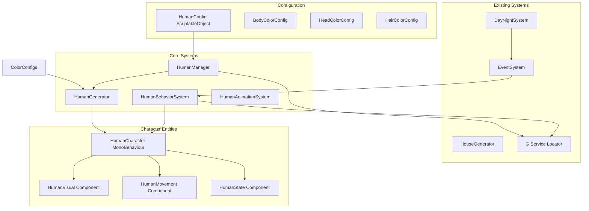
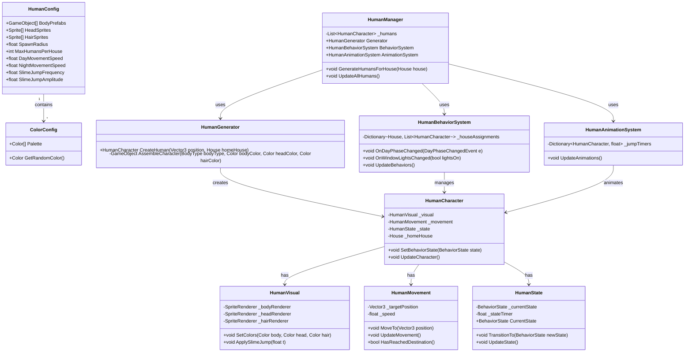

# Human Character System Architecture

## Overview
This document outlines the architecture for a human character system in Unity that meets the following requirements:

1. **Character Components**: Body, Head, and Hair (прическа)
2. **Prefab System**: Array of prefabs for bodies (different heights)
3. **Color Configuration**: Random colors from separate config files
4. **Generation**: Characters generated near houses
5. **Behavior Patterns**:
   - **Day**: Move around field with "slime jump" pulsating animation
   - **Night** (when lights turn on): Run back home
   - **Morning**: Come out again

## Architecture Principles
- **SOLID Principles**: Single responsibility, open/closed, Liskov substitution, interface segregation, dependency inversion
- **Service Locator Pattern**: Use existing 'G' static class for global references
- **ScriptableObject Configuration**: All configs as ScriptableObjects with self-registration
- **Zero Allocations**: No GC allocations in Update/FixedUpdate loops
- **Event-Driven**: Leverage existing EventSystem for day/night transitions

## System Architecture

### 1. Core Systems



### 2. Class Relationships



## 3. ScriptableObject Configuration Structure

### HumanConfig.asset
```csharp
[CreateAssetMenu(fileName = "HumanConfig", menuName = "Game/Human Config", order = 110)]
public class HumanConfig : ScriptableObject
{
    [Header("Prefab Settings")]
    [SerializeField] private GameObject[] _bodyPrefabs; // Different height bodies
    [SerializeField] private Sprite[] _headSprites;
    [SerializeField] private Sprite[] _hairSprites;
    
    [Header("Color Config References")]
    [SerializeField] private BodyColorConfig _bodyColorConfig;
    [SerializeField] private HeadColorConfig _headColorConfig;
    [SerializeField] private HairColorConfig _hairColorConfig;
    
    [Header("Generation Settings")]
    [SerializeField] private float _spawnRadius = 5f;
    [SerializeField] [Range(1, 10)] private int _maxHumansPerHouse = 3;
    [SerializeField] private float _minSpawnDistanceFromHouse = 2f;
    
    [Header("Movement Settings")]
    [SerializeField] private float _dayMovementSpeed = 2f;
    [SerializeField] private float _nightMovementSpeed = 4f;
    [SerializeField] private float _wanderRadius = 10f;
    
    [Header("Animation Settings")]
    [SerializeField] private float _slimeJumpFrequency = 1f;
    [SerializeField] private float _slimeJumpAmplitude = 0.2f;
    [SerializeField] private AnimationCurve _slimeJumpCurve = AnimationCurve.EaseInOut(0, 0, 1, 1);
    
    [Header("Behavior Timing")]
    [SerializeField] private float _morningExitTime = 0.25f; // Normalized time
    [SerializeField] private float _eveningReturnTime = 0.75f; // Normalized time
    
    // Properties with getters...
    // Self-registration in OnEnable/OnDisable
}
```

### Color Configs (BodyColorConfig, HeadColorConfig, HairColorConfig)
```csharp
[CreateAssetMenu(fileName = "BodyColorConfig", menuName = "Game/Body Color Config", order = 111)]
public class BodyColorConfig : ScriptableObject
{
    [SerializeField] private Color[] _palette = new Color[]
    {
        new Color(0.9f, 0.8f, 0.7f), // Light skin
        new Color(0.7f, 0.6f, 0.5f), // Medium skin
        new Color(0.5f, 0.4f, 0.3f), // Dark skin
    };
    
    public Color GetRandomColor() => _palette[Random.Range(0, _palette.Length)];
    
    // Self-registration to G.BodyColorConfig
}
```

## 4. Character Assembly System

### Assembly Process:
1. **Select Body**: Randomly choose from body prefab array
2. **Select Head/Hair Sprites**: Random selection from available sprites
3. **Apply Colors**: Get random colors from respective color configs
4. **Assemble Hierarchy**: Instantiate body prefab, attach head/hair as child SpriteRenderers
5. **Configure Components**: Add HumanCharacter, HumanVisual, HumanMovement, HumanState

### HumanGenerator Class:
```csharp
public class HumanGenerator : MonoBehaviour
{
    private HumanConfig _config;
    private ObjectPool _pool;
    
    public HumanCharacter CreateHuman(Vector3 position, House homeHouse)
    {
        // 1. Get configuration
        _config = G.HumanConfig;
        
        // 2. Select components
        GameObject bodyPrefab = _config.BodyPrefabs.RandomElement();
        Sprite headSprite = _config.HeadSprites.RandomElement();
        Sprite hairSprite = _config.HairSprites.RandomElement();
        
        // 3. Get colors
        Color bodyColor = _config.BodyColorConfig.GetRandomColor();
        Color headColor = _config.HeadColorConfig.GetRandomColor();
        Color hairColor = _config.HairColorConfig.GetRandomColor();
        
        // 4. Assemble character
        GameObject humanObj = Instantiate(bodyPrefab, position, Quaternion.identity);
        HumanCharacter human = humanObj.AddComponent<HumanCharacter>();
        
        // 5. Configure
        human.Initialize(homeHouse, bodyColor, headColor, hairColor, headSprite, hairSprite);
        
        return human;
    }
}
```

## 5. Day/Night Behavior State Machine

### Behavior States:
```csharp
public enum BehaviorState
{
    Idle,           // Initial state
    Wandering,      // Day: Moving randomly with slime jump
    ReturningHome,  // Night: Running back to home
    AtHome,         // At home position (night)
    ExitingHome     // Morning: Coming out of home
}
```

### State Transitions:
- **Day Phase (6:00-18:00)**: `ExitingHome` → `Wandering`
- **Evening Lights On**: `Wandering` → `ReturningHome`
- **Reached Home**: `ReturningHome` → `AtHome`
- **Morning (6:00)**: `AtHome` → `ExitingHome`

### Integration with DayNightSystem:
```csharp
public class HumanBehaviorSystem : MonoBehaviour
{
    private void OnEnable()
    {
        G.Events.Subscribe<DayPhaseChangedEvent>(OnDayPhaseChanged);
        G.Events.Subscribe<WindowLightsChangedEvent>(OnWindowLightsChanged);
    }
    
    private void OnDayPhaseChanged(DayPhaseChangedEvent e)
    {
        switch (e.NewPhase)
        {
            case Phase.Dawn:
                TransitionAllToState(BehaviorState.ExitingHome);
                break;
            case Phase.Day:
                TransitionAllToState(BehaviorState.Wandering);
                break;
            case Phase.Dusk:
                // Start returning when lights turn on (handled by WindowLightsChangedEvent)
                break;
            case Phase.Night:
                // Ensure all humans are at home
                break;
        }
    }
    
    private void OnWindowLightsChanged(WindowLightsChangedEvent e)
    {
        if (e.LightsOn && G.DayNightSystem.CurrentPhase == Phase.Dusk)
        {
            TransitionAllToState(BehaviorState.ReturningHome);
        }
    }
}
```

## 6. Animation System

### Slime Jump Animation:
- Pulsating scale animation using sine wave
- Cached AnimationCurve evaluation
- Zero allocation implementation:

```csharp
public class HumanAnimationSystem : MonoBehaviour
{
    private struct JumpData
    {
        public HumanVisual Visual;
        public float Timer;
        public float Frequency;
        public float Amplitude;
    }
    
    private List<JumpData> _jumpAnimations = new List<JumpData>(50);
    private AnimationCurve _cachedCurve;
    
    public void UpdateAnimations()
    {
        float deltaTime = Time.deltaTime;
        
        for (int i = 0; i < _jumpAnimations.Count; i++)
        {
            var data = _jumpAnimations[i];
            data.Timer += deltaTime * data.Frequency;
            
            float t = Mathf.Sin(data.Timer * Mathf.PI * 2f) * 0.5f + 0.5f;
            float scale = 1f + _cachedCurve.Evaluate(t) * data.Amplitude;
            
            data.Visual.ApplySlimeJump(scale);
            
            _jumpAnimations[i] = data; // Update struct
        }
    }
}
```

## 7. Integration Points with Existing Systems

### G Service Locator Additions:
```csharp
public static class G
{
    // Add to existing G class
    public static HumanConfig HumanConfig { get; set; }
    public static HumanManager HumanManager { get; set; }
    public static BodyColorConfig BodyColorConfig { get; set; }
    public static HeadColorConfig HeadColorConfig { get; set; }
    public static HairColorConfig HairColorConfig { get; set; }
    
    // Helper methods
    public static bool HasHumanConfig() => HumanConfig != null;
    public static bool HasHumanManager() => HumanManager != null;
}
```

### House Integration:
- Humans are assigned to houses during generation
- House class needs reference to assigned humans
- HumanGenerator works with HouseGenerator for coordinated spawning

### Event System Integration:
- Subscribe to: `DayPhaseChangedEvent`, `WindowLightsChangedEvent`
- Emit: `HumanSpawnedEvent`, `HumanReturnedHomeEvent` for game logic

## 8. Performance Considerations

### Zero Allocations:
1. **Update Loops**: Use pre-allocated lists, avoid LINQ, foreach with arrays
2. **Event Objects**: Reuse cached event instances where possible
3. **Object Pooling**: Use existing ObjectPool system for character instantiation
4. **Coroutine Alternatives**: Use async/await with UniTask instead of Coroutines

### Optimization Strategies:
1. **Batch Updates**: HumanManager updates all humans in single loop
2. **Distance Culling**: Only update humans within camera view
3. **LOD System**: Reduce animation complexity for distant humans
4. **Cached References**: All GetComponent calls in Awake/Start

### Memory Management:
```csharp
public class HumanManager : MonoBehaviour
{
    private HumanCharacter[] _humans = new HumanCharacter[100]; // Pre-allocated
    private int _activeCount = 0;
    
    // Use array instead of List for cache locality
    public void UpdateAllHumans()
    {
        for (int i = 0; i < _activeCount; i++)
        {
            _humans[i].UpdateCharacter(); // Virtual or interface call
        }
    }
}
```

## 9. File Structure

```
Assets/_Project/
├── Scripts/
│   ├── Human/
│   │   ├── HumanCharacter.cs
│   │   ├── HumanVisual.cs
│   │   ├── HumanMovement.cs
│   │   ├── HumanState.cs
│   │   ├── HumanManager.cs
│   │   ├── HumanGenerator.cs
│   │   ├── HumanBehaviorSystem.cs
│   │   └── HumanAnimationSystem.cs
│   ├── Configs/
│   │   ├── HumanConfig.cs
│   │   ├── BodyColorConfig.cs
│   │   ├── HeadColorConfig.cs
│   │   └── HairColorConfig.cs
│   └── Core/
│       └── G.cs (extended)
├── Prefabs/
│   └── Human/
│       ├── Body_1.prefab
│       ├── Body_2.prefab
│       └── ...
└── Sprites/
    └── peoples/ (existing)
```

## 10. Implementation Sequence

1. **Create ScriptableObject configs** (HumanConfig, ColorConfigs)
2. **Extend G class** with new references
3. **Implement core components** (HumanCharacter, HumanVisual, HumanMovement, HumanState)
4. **Build assembly system** (HumanGenerator)
5. **Implement behavior state machine** (HumanBehaviorSystem)
6. **Add animation system** (HumanAnimationSystem)
7. **Create manager class** (HumanManager)
8. **Integrate with existing systems** (DayNight, HouseGenerator)
9. **Optimize for performance** (zero allocations, pooling)
10. **Test and iterate**

## 11. Dependencies

- Existing `G` service locator pattern
- Existing `EventSystem` for day/night events
- Existing `ObjectPool` for instantiation
- Existing `DayNightSystem` for time tracking
- Existing `HouseGenerator` for house references
- `UniTask` package for async operations (optional but recommended)

This architecture provides a scalable, performant solution that integrates seamlessly with the existing project while adhering to SOLID principles and the project's coding standards.