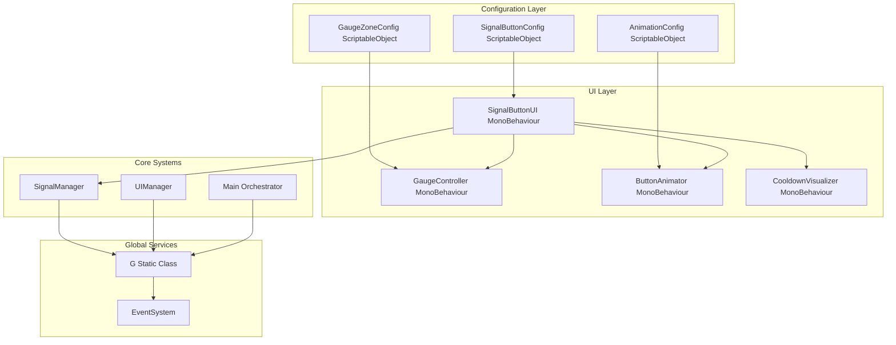

# Signal Button UI System Architecture

## Overview
This document outlines the architecture for a Unity UI system featuring a button with a semicircular gauge, hover animations, and signal strength mechanics. The system follows the project's established architectural patterns: ScriptableObject-based configuration, SOLID principles, the 'G' static class service locator, and zero-allocation performance constraints.

## System Requirements
1. **Button**: Sends a signal when clicked
2. **Semicircular Gauge**: Above the button with moving arrow (degrees-based movement)
3. **Three Zones**: Red (weak), Yellow (medium), Green (strong)
4. **Signal Strength Multiplier**:
   - Green zone: 3x multiplier (strong signal)
   - Yellow zone: 1x multiplier (medium signal)
   - Red zone: 0.5x multiplier (weak signal)
5. **Hover Animation**: Smooth scale-up and outline activation
6. **Cooldown**: 5-second cooldown after clicking before button can be clicked again

## Architecture Diagram



## Class Structure & Responsibilities

### 1. Configuration Classes (ScriptableObjects)

#### `SignalButtonConfig`
- **Path**: `Assets/_Project/Scripts/UI/SignalButton/Config/SignalButtonConfig.cs`
- **Purpose**: Central configuration for the signal button system
- **Properties**:
  - `CooldownDuration`: float (default: 5.0f)
  - `HoverScaleMultiplier`: float (default: 1.1f)
  - `HoverAnimationDuration`: float (default: 0.2f)
  - `ClickAnimationDuration`: float (default: 0.1f)
  - `OutlineColor`: Color
  - `OutlineWidth`: float
  - `ArrowRotationSpeed`: float (degrees per second)
  - `ArrowMovementPattern`: enum (Linear, EaseInOut, Random)

#### `GaugeZoneConfig`
- **Path**: `Assets/_Project/Scripts/UI/SignalButton/Config/GaugeZoneConfig.cs`
- **Purpose**: Defines the three zones of the semicircular gauge
- **Properties**:
  - `RedZoneRange`: Vector2 (minAngle, maxAngle in degrees)
  - `YellowZoneRange`: Vector2
  - `GreenZoneRange`: Vector2
  - `ZoneColors`: array of Color[3] (red, yellow, green)
  - `ZoneMultipliers`: array of float[3] (0.5f, 1.0f, 3.0f)

#### `AnimationConfig`
- **Path**: `Assets/_Project/Scripts/UI/SignalButton/Config/AnimationConfig.cs`
- **Purpose**: Animation curves and timing configurations
- **Properties**:
  - `HoverScaleCurve`: AnimationCurve
  - `ClickScaleCurve`: AnimationCurve
  - `OutlineFadeCurve`: AnimationCurve
  - `ArrowMovementCurve`: AnimationCurve
  - `CooldownFillCurve`: AnimationCurve

### 2. Core UI Components

#### `SignalButtonUI` (Main Controller)
- **Path**: `Assets/_Project/Scripts/UI/SignalButton/SignalButtonUI.cs`
- **Purpose**: Orchestrates all button functionality and coordinates sub-components
- **Responsibilities**:
  - Manages button click detection (using New Input System via raycasting)
  - Coordinates hover animations through ButtonAnimator
  - Retrieves current gauge zone from GaugeController
  - Triggers signal emission with appropriate multiplier
  - Manages cooldown state and visual feedback
  - Self-registers with G.UI if needed
- **Dependencies**:
  - `ButtonAnimator` (child component)
  - `GaugeController` (child component)
  - `CooldownVisualizer` (child component)
  - `SignalButtonConfig` (serialized reference)

#### `GaugeController`
- **Path**: `Assets/_Project/Scripts/UI/SignalButton/GaugeController.cs`
- **Purpose**: Manages the semicircular gauge visualization and arrow movement
- **Responsibilities**:
  - Updates arrow rotation based on configured movement pattern
  - Determines current zone (red/yellow/green) based on arrow angle
  - Visualizes zone segments with appropriate colors
  - Provides public method to get current zone and multiplier
  - Implements zero-allocation Update loop using cached references
- **Properties**:
  - `CurrentAngle`: float (read-only, 0-180 degrees)
  - `CurrentZone`: GaugeZone enum (Red, Yellow, Green)
  - `CurrentMultiplier`: float (read-only)

#### `ButtonAnimator`
- **Path**: `Assets/_Project/Scripts/UI/SignalButton/ButtonAnimator.cs`
- **Purpose**: Handles all button visual animations
- **Responsibilities**:
  - Hover animation: smooth scale-up and outline activation
  - Click animation: brief scale pulse
  - Outline fade in/out using DOTween (cached instances)
  - Implements animation state machine to prevent conflicts
  - Uses cached AnimationCurve references for performance

#### `CooldownVisualizer`
- **Path**: `Assets/_Project/Scripts/UI/SignalButton/CooldownVisualizer.cs`
- **Purpose**: Visual feedback for button cooldown state
- **Responsibilities**:
  - Shows cooldown progress (radial fill or timer text)
  - Disables button interactivity during cooldown
  - Updates cooldown fill using Image.fillAmount (no allocations)
  - Provides visual feedback when cooldown completes

### 3. Signal Management

#### `SignalManager`
- **Path**: `Assets/_Project/Scripts/Core/SignalManager.cs`
- **Purpose**: Centralized signal emission and strength calculation
- **Responsibilities**:
  - Receives signal requests from UI components
  - Applies zone-based multipliers to signal strength
  - Broadcasts signal events through EventSystem
  - Integrates with existing SignalScheduler system
  - Self-registers with G.SignalManager

### 4. Integration Classes

#### `SignalButtonUIManager`
- **Path**: `Assets/_Project/Scripts/UI/SignalButton/SignalButtonUIManager.cs`
- **Purpose**: Manages multiple signal button instances if needed
- **Responsibilities**:
  - Factory pattern for creating signal button prefabs
  - Pooling of button instances for performance
  - Centralized configuration management

## ScriptableObject Configuration Design

### File Structure
```
Assets/_Project/ScriptableObjects/UI/SignalButton/
├── SignalButtonConfig.asset
├── GaugeZoneConfig.asset
└── AnimationConfig.asset
```

### Configuration Properties Details

#### SignalButtonConfig.asset
```csharp
[CreateAssetMenu(fileName = "SignalButtonConfig", menuName = "UI/SignalButton/Config")]
public class SignalButtonConfig : ScriptableObject
{
    [Header("Timing")]
    [SerializeField, Range(1f, 10f)] private float _cooldownDuration = 5f;
    [SerializeField, Range(0.1f, 2f)] private float _hoverAnimationDuration = 0.2f;
    
    [Header("Visual")]
    [SerializeField, Range(1f, 1.5f)] private float _hoverScaleMultiplier = 1.1f;
    [SerializeField] private Color _outlineColor = Color.cyan;
    [SerializeField, Range(1f, 10f)] private float _outlineWidth = 2f;
    
    [Header("Arrow Movement")]
    [SerializeField, Range(10f, 360f)] private float _arrowRotationSpeed = 90f;
    [SerializeField] private ArrowMovementPattern _movementPattern = ArrowMovementPattern.Linear;
    
    // Properties with getters...
}
```

#### GaugeZoneConfig.asset
```csharp
[CreateAssetMenu(fileName = "GaugeZoneConfig", menuName = "UI/SignalButton/GaugeZoneConfig")]
public class GaugeZoneConfig : ScriptableObject
{
    [Header("Zone Angles (0-180 degrees)")]
    [SerializeField] private Vector2 _redZoneRange = new Vector2(0f, 60f);
    [SerializeField] private Vector2 _yellowZoneRange = new Vector2(60f, 120f);
    [SerializeField] private Vector2 _greenZoneRange = new Vector2(120f, 180f);
    
    [Header("Zone Colors")]
    [SerializeField] private Color _redZoneColor = Color.red;
    [SerializeField] private Color _yellowZoneColor = Color.yellow;
    [SerializeField] private Color _greenZoneColor = Color.green;
    
    [Header("Zone Multipliers")]
    [SerializeField, Range(0f, 1f)] private float _redZoneMultiplier = 0.5f;
    [SerializeField, Range(0.5f, 2f)] private float _yellowZoneMultiplier = 1f;
    [SerializeField, Range(1f, 5f)] private float _greenZoneMultiplier = 3f;
    
    // Validation and getter methods...
}
```

## UI Component Hierarchy

### Canvas Structure
```
SignalButtonCanvas (Canvas)
├── BackgroundPanel (Image)
├── GaugeContainer (RectTransform)
│   ├── GaugeBackground (Image, semicircular mask)
│   ├── ZoneRed (Image, filled image)
│   ├── ZoneYellow (Image, filled image)
│   ├── ZoneGreen (Image, filled image)
│   └── ArrowPivot (RectTransform)
│       └── ArrowImage (Image)
├── ButtonContainer (RectTransform)
│   ├── ButtonBackground (Image)
│   ├── ButtonOutline (Image, disabled by default)
│   └── ButtonText (TextMeshProUGUI)
└── CooldownOverlay (RectTransform)
    ├── CooldownFill (Image, radial fill)
    └── CooldownText (TextMeshProUGUI)
```

### Prefab Structure
```
Assets/_Project/Prefabs/UI/SignalButton/
└── SignalButton.prefab
    ├── SignalButtonUI (Script)
    ├── GaugeController (Script)
    ├── ButtonAnimator (Script)
    └── CooldownVisualizer (Script)
```

## Integration Points with Existing Systems

### 1. Global Service Locator (G Class)
- **Registration**: `SignalButtonUI` will optionally register with `G.UI` if it's the primary signal button
- **Access**: `SignalManager` will register with `G.SignalManager` for system-wide access
- **Configuration**: Config ScriptableObjects will be referenced via `G.Config` or direct serialization

### 2. Main Orchestrator
- **Initialization**: `Main` will ensure SignalButton system is initialized during gameplay state
- **Game State**: Button interactivity respects `Main.CurrentState` (disabled during pause/intro)

### 3. EventSystem Integration
- **Signal Events**: Use existing `EventSystem` (`G.Events`) for decoupled communication
- **Event Types**:
  - `SignalButtonHoverEvent` (for audio/visual feedback)
  - `SignalButtonClickEvent` (with strength multiplier)
  - `SignalButtonCooldownCompleteEvent`

### 4. SignalScheduler Compatibility
- **Coordination**: `SignalManager` will coordinate with existing `SignalScheduler` to avoid conflicts
- **Priority**: Manual button signals may override or complement scheduled signals

### 5. Audio System
- **Feedback**: Button hover/click/cooldown sounds via `G.Audio`
- **Integration**: Audio triggers through event subscriptions

### 6. Input System
- **New Input System**: Use `G.Input` for consistent input handling
- **Platform Support**: Touch/mouse/controller support through InputAction assets

## Performance Considerations

### Zero-Allocation Constraints
1. **Update Loops**: All `Update()` methods must avoid:
   - `new` object creation
   - String concatenation
   - LINQ queries
   - Unnecessary `GetComponent<>()` calls

2. **Caching Strategy**:
   - Cache all `Transform`, `Image`, `TextMeshProUGUI` references in `Awake()`
   - Cache `AnimationCurve` references from ScriptableObjects
   - Cache `DOTween` sequences and reuse them

3. **Animation Optimization**:
   - Use `DOTween` with cached `Tweener` instances
   - Prefer `DOTween.To()` with lambda callbacks over coroutines
   - Cache `WaitForSeconds` instances if using coroutines

4. **UI Rendering**:
   - Use Canvas pooling for dynamic instantiation
   - Implement `CanvasGroup` for batch alpha changes
   - Avoid `LayoutGroup` components during runtime

### Memory Management
1. **Object Pooling**: Use `G.Pool` for button instances if multiple buttons are needed
2. **Event Unsubscription**: Ensure proper `OnDestroy()` cleanup
3. **ScriptableObject References**: Use `[SerializeField]` not `Resources.Load()`

### Rendering Performance
1. **Draw Calls**: Keep gauge and button in same canvas to minimize batches
2. **Mask Usage**: Semicircular gauge uses `Mask` component - consider shader-based alternative
3. **Outline Effect**: Use `Outline` component sparingly or implement via shader

## Implementation Sequence

### Phase 1: Foundation
1. Create ScriptableObject configuration assets
2. Implement `GaugeController` with basic arrow movement
3. Create UI prefab structure

### Phase 2: Core Functionality
1. Implement `SignalButtonUI` click detection and cooldown
2. Add `ButtonAnimator` hover/click animations
3. Integrate `CooldownVisualizer`

### Phase 3: Integration
1. Implement `SignalManager` and event system
2. Register with `G` static class
3. Connect with audio and input systems

### Phase 4: Polish
1. Add visual feedback (particles, sounds)
2. Implement configuration validation
3. Add editor tools for zone visualization

## Risk Mitigation

### Technical Risks
1. **Performance Issues**: Address through rigorous profiling and zero-allocation patterns
2. **Input Conflicts**: Use Input System's action maps and proper cancellation
3. **UI Scaling**: Design with Canvas Scaler and reference resolution in mind

### Design Risks
1. **Zone Balance**: Make zone ranges configurable for game balancing
2. **Visual Clarity**: Ensure gauge zones are clearly distinguishable
3. **Feedback**: Provide clear visual/audio feedback for all interactions

## Conclusion
This architecture provides a modular, performant solution that integrates seamlessly with the existing project structure. By following SOLID principles and the project's established patterns (ScriptableObject configs, G service locator, zero-allocation constraints), the system will be maintainable, testable, and performant.

The design separates concerns appropriately: configuration from behavior, visualization from logic, and animation from state management. This allows for easy tuning of game balance (zone ranges, multipliers) and visual polish (animation curves, colors) without code changes.