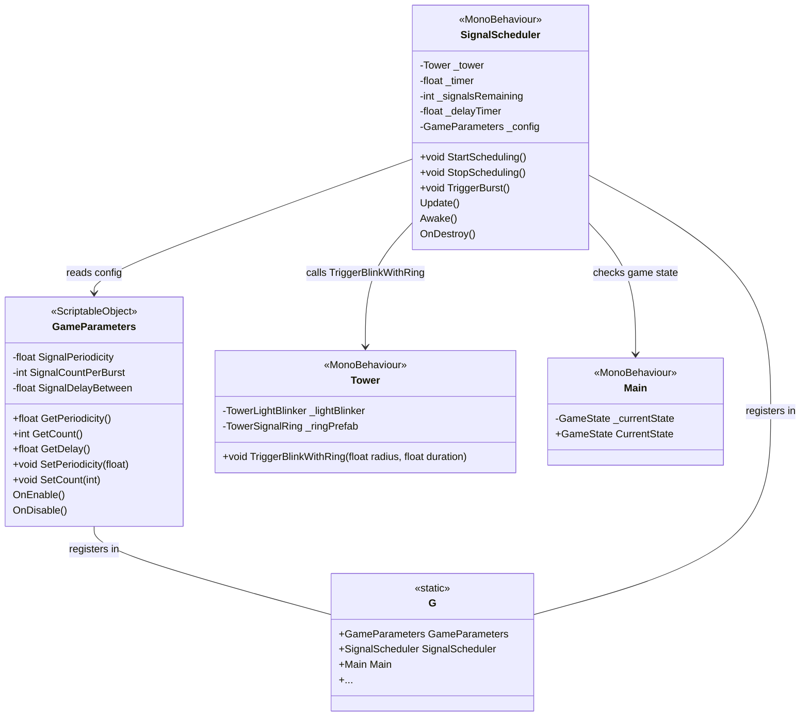

# Signal Scheduling System Architecture

## Overview
Design for a system that triggers `TriggerBlinkWithRing` with specific periodicity and count, configurable via ScriptableObject, with runtime-modifiable parameters stored in a `GameParameters` class.

## Requirements Analysis
1. **Core Functionality**: Schedule periodic signal bursts
   - Each burst consists of N signals triggered with fixed delay between them
   - Bursts repeat every T seconds (periodicity)
2. **Configuration**: Base periodicity and count should be configurable via ScriptableObject
3. **Game Parameters**: Values stored in separate `GameParameters` class that can be modified during gameplay
4. **Performance**: Zero allocations in Update loops, follow SOLID principles
5. **Integration**: Use existing `G` service locator pattern and project structure

## Existing Codebase Context
- **Tower.cs**: Contains `TriggerBlinkWithRing` method that triggers visual blink and ring expansion
- **G.cs**: Global service locator with self-registration pattern
- **Config Patterns**: Existing configs (CurrencyConfig, DayNightConfig) are ScriptableObjects that register themselves in `G` on enable
- **Project Structure**: Scripts go in `Assets/_Project/Scripts/` organized by feature

## Architecture Components

### 1. GameParameters ScriptableObject
**Purpose**: Central repository for game balance parameters, including signal scheduling values.

**Location**: `Assets/_Project/Scripts/Data/Configs/GameParameters.cs`

**Design**:
- Extends `ScriptableObject`
- Implements self-registration pattern (registers in `G.GameParameters`)
- Contains serialized fields for:
  - `SignalPeriodicity` (float) - Time between signal burst initiations (e.g., 30 seconds)
  - `SignalCountPerBurst` (int) - Number of signals triggered per burst
  - `SignalDelayBetween` (float) - Fixed delay between individual signals within a burst (constant)
  - Future expansion: other game balance parameters
- Public read-only properties with getters
- Optional: runtime modification methods (setters) with event notification

**Integration**:
- Registered in `G` as `G.GameParameters`
- Can be referenced by multiple systems

### 2. SignalScheduler MonoBehaviour
**Purpose**: Manages the timing and execution of signal bursts.

**Location**: `Assets/_Project/Scripts/Core/SignalScheduler.cs`

**Responsibilities**:
- Track time until next burst
- When burst time arrives, trigger N signals with fixed delay between them
- Handle pausing/resuming based on game state
- Zero allocations in Update (use cached timers, avoid LINQ/new objects)
- Self-register in `G.SignalScheduler`

**Design Patterns**:
- **State Pattern**: Different behaviors for Playing/Paused/Intro states
- **Observer Pattern**: Listen to game state changes via `G.Main` or events
- **Dependency Injection**: Get configuration from `G.GameParameters`

**Key Methods**:
- `StartScheduling()`: Begin the periodic schedule
- `StopScheduling()`: Stop all scheduled signals
- `TriggerBurst()`: Execute one burst of signals
- `Update()`: Update timers (only when game is playing)

### 3. SignalConfiguration (Optional)
**Consideration**: Could separate signal-specific parameters (ring radius, duration) from timing parameters. However, requirements indicate fixed delay constant and doesn't change, so these could be part of GameParameters or a separate ScriptableObject.

**Decision**: Include in GameParameters for simplicity unless signal visual parameters need independent configuration.

### 4. Tower Integration
**Assumption**: Single tower instance in the scene (common for this game type). If multiple towers, need targeting logic.

**Approach**:
- SignalScheduler needs reference to Tower component
- Could be obtained via `FindObjectOfType<Tower>` in Start (cached) or injected via inspector
- Prefer inspector reference for clarity and performance

**Alternative**: Use event system - Tower subscribes to signal events, but direct method call is simpler.

## Class Relationships



## Configuration Workflow

### 1. Asset Creation
- Create `GameParameters` asset via CreateAssetMenu
- Set default values in Inspector (periodicity = 30s, count = 3, delay = 0.5s)
- Place asset in `Assets/_Project/Configs/` folder

### 2. Runtime Registration
- `GameParameters.OnEnable()` registers itself in `G.GameParameters`
- `SignalScheduler.Awake()` fetches reference to `G.GameParameters` and `G.Main`
- `SignalScheduler` self-registers in `G.SignalScheduler`

### 3. Runtime Modification
- Game systems can modify parameters via `G.GameParameters.SetPeriodicity(value)`
- Changes take effect immediately (next burst uses new values)
- Optional: emit event when parameters change for UI updates

## Performance Considerations

1. **Zero Allocations in Update**:
   - Use `float` timers instead of `Coroutine` with `WaitForSeconds` allocations
   - Cache references to `Tower`, `GameParameters`, `Main`
   - Avoid LINQ, closures, and new object creation in loops

2. **Efficient Scheduling**:
   - Use simple delta-time accumulation in `Update`
   - When burst triggers, use `DOVirtual.DelayedCall` (DOTween) for individual signal delays (already used in Tower)
   - DOTween calls are pooled and efficient

3. **Game State Awareness**:
   - Pause scheduling when game state is not `Playing`
   - Listen to state changes via `G.Main.CurrentState` or events

## Integration with Existing Systems

### G Service Locator
- Add `public static GameParameters GameParameters { get; set; }`
- Add `public static SignalScheduler SignalScheduler { get; set; }`
- Add null-check helpers `HasGameParameters()`, `HasSignalScheduler()`

### Main Game State
- SignalScheduler should only run when `G.Main.CurrentState == GameState.Playing`
- Optionally auto-start when game enters Playing state

### Event System
- Could emit events when signals are triggered for other systems (audio, UI)
- Use existing `Utilities.EventSystem` if needed

## Implementation Plan

### Phase 1: GameParameters ScriptableObject
1. Create `GameParameters.cs` in `Assets/_Project/Scripts/Data/Configs/`
2. Implement serialized fields and properties
3. Add self-registration pattern (similar to CurrencyConfig)
4. Create asset instance in `Assets/_Project/Configs/GameParameters.asset`
5. Update `G.cs` to include `GameParameters` property and helper

### Phase 2: SignalScheduler Core
1. Create `SignalScheduler.cs` in `Assets/_Project/Scripts/Core/`
2. Implement timer logic and burst triggering
3. Add reference to Tower (inspector or Find)
4. Implement self-registration in `G`
5. Add game state awareness

### Phase 3: Integration
1. Add Tower reference in scene (if not already)
2. Configure GameParameters asset with desired values
3. Test signal scheduling in Play mode
4. Add runtime modification capability (optional)

### Phase 4: Polish & Extensibility
1. Add editor tools for testing (ContextMenu buttons)
2. Consider visual feedback for scheduling (UI timer)
3. Add events for other systems to react to signals

## File Structure
```
Assets/_Project/Scripts/
├── Core/
│   ├── SignalScheduler.cs
│   └── ...
├── Data/
│   └── Configs/
│       ├── GameParameters.cs
│       └── ...
└── Tower/
    └── Tower.cs (existing)
```

## Open Questions
1. **Multiple Towers**: Should signals target all towers or a specific one? Current design assumes single tower.
2. **Visual Parameters**: Should ring radius/duration be configurable per signal? Currently uses Tower's defaults.
3. **Persistence**: Should modified parameters be saved across sessions? Could integrate with SaveSystem.

## Next Steps
1. Review this architecture with the team
2. Adjust based on feedback
3. Proceed to implementation in Code mode