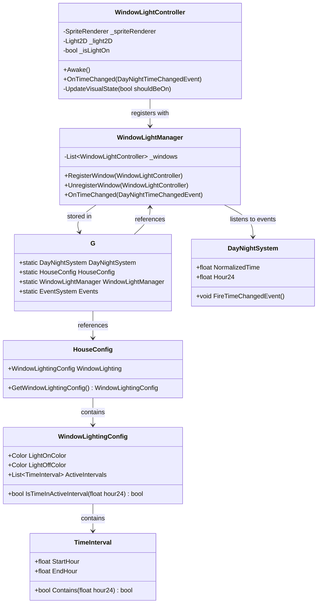

# Window Lighting System Architecture

## 1. Analysis of Existing Time System

### 1.1 DayNightSystem Overview
The existing time management system consists of:
- **DayNightSystem**: Core MonoBehaviour that tracks normalized time (0-1) and emits events
- **DayNightConfig**: ScriptableObject storing time configuration (day length, start time, curves)
- **Event System**: Pub/sub via `G.Events` with `DayNightTimeChangedEvent`
- **Time Progression**: Zero-allocation Update loop with configurable time scale and pause states

### 1.2 Key Integration Points
- **G.DayNightSystem**: Global reference to the active time system
- **G.DayNightConfig**: Global reference to time configuration
- **G.Events**: EventSystem for subscribing to time changes
- **DayNightTimeChangedEvent**: Contains `NormalizedTime` (0-1) and `Hour24` (0-24) properties
- **Time Change Threshold**: Events emitted when normalized time changes ≥ 0.001

### 1.3 HouseConfig Current State
- **Location**: `Assets/_Project/Scripts/HouseGenerator/Config/HouseConfig.cs`
- **Purpose**: Stores house generation data (colors, prefabs)
- **Self-Registration**: Automatically registers with `G.HouseConfig` on enable
- **Current Data**: Base saturation/value, roof color pairs, element prefabs

## 2. Proposed Architecture

### 2.1 System Overview
The window lighting system will extend the existing time/day-night system to provide automatic window illumination based on time intervals. The architecture follows SOLID principles and the project's established patterns.

### 2.2 Class Structure



### 2.3 Data Flow

```mermaid
flowchart TD
    A[DayNightSystem.Update] --> B{Time changed ≥ threshold?}
    B -->|Yes| C[Fire DayNightTimeChangedEvent]
    C --> D[G.Events.Trigger]
    D --> E[WindowLightManager.OnTimeChanged]
    E --> F[Get current hour24 from event]
    F --> G[Query HouseConfig.WindowLightingConfig]
    G --> H[Check if hour in active intervals]
    H --> I{Should lights be ON?}
    I -->|Yes| J[Notify all registered windows]
    I -->|No| K[Notify all registered windows]
    J --> L[WindowLightController.UpdateVisualState(true)]
    K --> M[WindowLightController.UpdateVisualState(false)]
    L --> N[Set SpriteRenderer.color = LightOnColor]
    N --> O[Enable Light2D component]
    M --> P[Set SpriteRenderer.color = LightOffColor]
    P --> Q[Disable Light2D component]
```

## 3. Detailed Component Design

### 3.1 HouseConfig Extension

**File**: `Assets/_Project/Scripts/HouseGenerator/Config/HouseConfig.cs`

Add new serializable classes and properties to HouseConfig:

```csharp
// New serializable classes in Project.HouseGenerator.Config namespace
[System.Serializable]
public class TimeInterval
{
    [SerializeField] [Range(0, 24)] private float _startHour = 18f;
    [SerializeField] [Range(0, 24)] private float _endHour = 20f;
    
    public float StartHour => _startHour;
    public float EndHour => _endHour;
    
    public bool Contains(float hour24)
    {
        // Handle wrap-around (e.g., 22-2)
        if (_startHour <= _endHour)
            return hour24 >= _startHour && hour24 < _endHour;
        else
            return hour24 >= _startHour || hour24 < _endHour;
    }
}

[System.Serializable]
public class WindowLightingConfig
{
    [SerializeField] private Color _lightOnColor = Color.yellow;
    [SerializeField] private Color _lightOffColor = Color.gray;
    [SerializeField] private List<TimeInterval> _activeIntervals = new();
    
    public Color LightOnColor => _lightOnColor;
    public Color LightOffColor => _lightOffColor;
    public IReadOnlyList<TimeInterval> ActiveIntervals => _activeIntervals;
    
    public bool IsTimeInActiveInterval(float hour24)
    {
        foreach (var interval in _activeIntervals)
        {
            if (interval.Contains(hour24))
                return true;
        }
        return false;
    }
}

// Add to HouseConfig class
[Header("Window Lighting")]
[SerializeField] private WindowLightingConfig _windowLightingConfig;

public WindowLightingConfig WindowLighting => _windowLightingConfig;
```

### 3.2 WindowLightController

**File**: `Assets/_Project/Scripts/Effects/WindowLightController.cs`

```csharp
// Path: Assets/_Project/Scripts/Effects/WindowLightController.cs

using Core;
using Project.Core.Events;
using Project.HouseGenerator.Config;
using UnityEngine;
using UnityEngine.Rendering.Universal;

namespace Project.Effects
{
    /// <summary>
    /// Controls individual window lighting based on time of day.
    /// Subscribes to DayNightTimeChangedEvent and updates SpriteRenderer color + Light2D state.
    /// Zero allocations in Update loop (event-driven).
    /// </summary>
    [RequireComponent(typeof(SpriteRenderer))]
    public class WindowLightController : MonoBehaviour
    {
        [Header("Component References")]
        [SerializeField] private SpriteRenderer _spriteRenderer;
        [SerializeField] private Light2D _light2D;
        
        [Header("Configuration Source")]
        [SerializeField] [Tooltip("If true, uses colors from G.HouseConfig.WindowLighting. If false, uses local inspector values.")]
        private bool _useConfig = true;
        
        [Header("Local Overrides")]
        [SerializeField] private Color _lightOnColorLocal = Color.yellow;
        [SerializeField] private Color _lightOffColorLocal = Color.gray;
        
        // Cached state
        private bool _isLightOn = false;
        private Color _lightOnColor;
        private Color _lightOffColor;
        
        #region Unity Lifecycle
        
        private void Awake()
        {
            CacheComponents();
            DetermineColors();
            RegisterWithManager();
        }
        
        private void Start()
        {
            SubscribeToEvents();
            // Initial update based on current time
            if (G.DayNightSystem != null)
                UpdateLightState(G.DayNightSystem.Hour24);
        }
        
        private void OnDestroy()
        {
            UnsubscribeFromEvents();
            UnregisterFromManager();
        }
        
        #endregion
        
        #region Initialization
        
        private void CacheComponents()
        {
            if (_spriteRenderer == null)
                _spriteRenderer = GetComponent<SpriteRenderer>();
            
            if (_light2D == null)
                _light2D = GetComponent<Light2D>();
        }
        
        private void DetermineColors()
        {
            if (_useConfig && G.HouseConfig != null && G.HouseConfig.WindowLighting != null)
            {
                var config = G.HouseConfig.WindowLighting;
                _lightOnColor = config.LightOnColor;
                _lightOffColor = config.LightOffColor;
            }
            else
            {
                _lightOnColor = _lightOnColorLocal;
                _lightOffColor = _lightOffColorLocal;
            }
        }
        
        private void RegisterWithManager()
        {
            if (G.WindowLightManager != null)
                G.WindowLightManager.RegisterWindow(this);
        }
        
        private void UnregisterFromManager()
        {
            if (G.WindowLightManager != null)
                G.WindowLightManager.UnregisterWindow(this);
        }
        
        #endregion
        
        #region Event Handling
        
        private void SubscribeToEvents()
        {
            if (G.Events != null)
                G.Events.Subscribe<DayNightTimeChangedEvent>(OnTimeChanged);
        }
        
        private void UnsubscribeFromEvents()
        {
            if (G.Events != null)
                G.Events.Unsubscribe<DayNightTimeChangedEvent>(OnTimeChanged);
        }
        
        private void OnTimeChanged(DayNightTimeChangedEvent evt)
        {
            // Event-driven update - zero allocations
            UpdateLightState(evt.Hour24);
        }
        
        #endregion
        
        #region State Management
        
        public void UpdateLightState(float hour24)
        {
            bool shouldBeOn = ShouldLightBeOn(hour24);
            
            if (shouldBeOn != _isLightOn)
            {
                UpdateVisualState(shouldBeOn);
                _isLightOn = shouldBeOn;
            }
        }
        
        private bool ShouldLightBeOn(float hour24)
        {
            if (!_useConfig || G.HouseConfig == null || G.HouseConfig.WindowLighting == null)
                return false; // Fallback: always off
            
            return G.HouseConfig.WindowLighting.IsTimeInActiveInterval(hour24);
        }
        
        private void UpdateVisualState(bool isOn)
        {
            // Update SpriteRenderer color
            _spriteRenderer.color = isOn ? _lightOnColor : _lightOffColor;
            
            // Update Light2D activation
            if (_light2D != null)
                _light2D.enabled = isOn;
        }
        
        #endregion
        
        #region Public API
        
        /// <summary>
        /// Forces a refresh of colors from config and updates visual state.
        /// </summary>
        public void RefreshConfiguration()
        {
            DetermineColors();
            if (G.DayNightSystem != null)
                UpdateLightState(G.DayNightSystem.Hour24);
        }
        
        /// <summary>
        /// Manually sets the light state (bypasses time logic).
        /// </summary>
        public void SetLightState(bool isOn)
        {
            UpdateVisualState(isOn);
            _isLightOn = isOn;
        }
        
        #endregion
    }
}
```

### 3.3 WindowLightManager

**File**: `Assets/_Project/Scripts/Effects/WindowLightManager.cs`

```csharp
// Path: Assets/_Project/Scripts/Effects/WindowLightManager.cs

using System.Collections.Generic;
using Core;
using Project.Core.Events;
using UnityEngine;

namespace Project.Effects
{
    /// <summary>
    /// Central manager for all window lights in the scene.
    /// Optimizes time event handling by broadcasting to registered windows.
    /// Registers itself into G.WindowLightManager.
    /// </summary>
    public class WindowLightManager : MonoBehaviour
    {
        private readonly List<WindowLightController> _windows = new();
        private bool _isSubscribed = false;
        
        #region Unity Lifecycle
        
        private void Awake()
        {
            RegisterWithG();
        }
        
        private void Start()
        {
            SubscribeToEvents();
        }
        
        private void OnDestroy()
        {
            UnsubscribeFromEvents();
            UnregisterFromG();
            _windows.Clear();
        }
        
        #endregion
        
        #region G Integration
        
        private void RegisterWithG()
        {
            if (G.WindowLightManager == null)
            {
                G.WindowLightManager = this;
                G.EnsureSystem(nameof(WindowLightManager), this);
            }
            else
            {
                Debug.LogWarning("[WindowLightManager] G.WindowLightManager already occupied. Not registering.", this);
            }
        }
        
        private void UnregisterFromG()
        {
            if (G.WindowLightManager == this)
                G.WindowLightManager = null;
        }
        
        #endregion
        
        #region Event Handling
        
        private void SubscribeToEvents()
        {
            if (G.Events != null && !_isSubscribed)
            {
                G.Events.Subscribe<DayNightTimeChangedEvent>(OnTimeChanged);
                _isSubscribed = true;
            }
        }
        
        private void UnsubscribeFromEvents()
        {
            if (G.Events != null && _isSubscribed)
            {
                G.Events.Unsubscribe<DayNightTimeChangedEvent>(OnTimeChanged);
                _isSubscribed = false;
            }
        }
        
        private void OnTimeChanged(DayNightTimeChangedEvent evt)
        {
            // Broadcast to all registered windows
            foreach (var window in _windows)
            {
                if (window != null && window.gameObject.activeInHierarchy)
                    window.UpdateLightState(evt.Hour24);
            }
        }
        
        #endregion
        
        #region Window Registration
        
        public void RegisterWindow(WindowLightController window)
        {
            if (window == null || _windows.Contains(window))
                return;
            
            _windows.Add(window);
        }
        
        public void UnregisterWindow(WindowLightController window)
        {
            _windows.Remove(window);
        }
        
        public int GetWindowCount() => _windows.Count;
        
        #endregion
        
        #region Public API
        
        /// <summary>
        /// Forces all registered windows to update based on current time.
        /// </summary>
        public void RefreshAllWindows()
        {
            if (G.DayNightSystem == null)
                return;
                
            float currentHour = G.DayNightSystem.Hour24;
            foreach (var window in _windows)
            {
                if (window != null)
                    window.UpdateLightState(currentHour);
            }
        }
        
        #endregion
    }
}
```

### 3.4 G Static Class Extension

**File**: `Assets/_Project/Scripts/Core/G.cs`

Add the following property to the G class:

```csharp
// In the G static class
public static WindowLightManager WindowLightManager { get; set; }

// Helper method (if not already present)
public static bool HasWindowLightManager() => WindowLightManager != null;
```

## 4. Integration Points

### 4.1 With Existing Time System
- **Event Subscription**: Both `WindowLightController` and `WindowLightManager` subscribe to `DayNightTimeChangedEvent`
- **Time Query**: Uses `G.DayNightSystem.Hour24` for initial state and manual refreshes
- **Zero Allocations**: Event-driven updates ensure no GC allocations in Update loops

### 4.2 With HouseConfig
- **Color Source**: Window colors sourced from `G.HouseConfig.WindowLighting`
- **Interval Logic**: Time interval checking delegated to `WindowLightingConfig`
- **Self-Registration**: HouseConfig already registers with G, no changes needed

### 4.3 With G Service Locator
- **New Reference**: `G.WindowLightManager` provides global access to the manager
- **Self-Registration**: `WindowLightManager` registers itself in `Awake()`
- **Fallback Handling**: Components gracefully handle missing manager/config

## 5. Performance Considerations

### 5.1 Zero Allocations
- **Event Objects**: Reused `DayNightTimeChangedEvent` from DayNightSystem (already zero-alloc)
- **List Management**: `WindowLightManager` uses `List<WindowLightController>` with Add/Remove
- **Update Loops**: No Update methods in window controllers; all updates event-driven

### 5.2 Optimization Strategies
- **Batching**: `WindowLightManager` batches updates to all windows in single event handler
- **Null Checking**: Skip destroyed/inactive windows in iteration
- **Config Caching**: WindowLightController caches colors in `Awake()` to avoid repeated G.HouseConfig access

### 5.3 Memory Footprint
- **Per Window**: ~40 bytes (references + bool + colors)
- **Manager**: List overhead + subscription flag
- **Config**: Additional ~100 bytes in HouseConfig asset

## 6. File Structure

```
Assets/_Project/
├── Scripts/
│   ├── Core/
│   │   └── G.cs (add WindowLightManager property)
│   ├── Effects/
│   │   ├── WindowLightController.cs (new)
│   │   └── WindowLightManager.cs (new)
│   └── HouseGenerator/
│       └── Config/
│           ├── HouseConfig.cs (extend with WindowLightingConfig)
│           ├── WindowLightingConfig.cs (new, optional separate file)
│           └── TimeInterval.cs (new, optional separate file)
├── Configs/
│   └── HouseConfig.asset (add Window Lighting section in Inspector)
└── Prefabs/
    └── House/
        └── Window.prefab (add WindowLightController component)
```

## 7. Implementation Sequence

1. **Extend HouseConfig** with WindowLightingConfig and TimeInterval classes
2. **Create WindowLightManager** as central coordinator
3. **Create WindowLightController** for individual window control
4. **Update G class** with WindowLightManager property
5. **Configure HouseConfig asset** with light colors and time intervals
6. **Add WindowLightController** to window prefabs
7. **Add WindowLightManager** to scene (or create via code)

## 8. Testing Considerations

- **Time Interval Edge Cases**: Test wrap-around intervals (e.g., 22:00-02:00)
- **Missing Dependencies**: Test behavior when G.HouseConfig or G.DayNightSystem are null
- **Performance**: Profile with 100+ windows to ensure no frame drops
- **Save/Load**: Ensure window states are not saved (they're time-driven)

## 9. Future Extensions

- **Randomized Intervals**: Add per-window time offset for more natural appearance
- **Animation Support**: Smooth color transitions between states
- **Player Interaction**: Allow players to manually toggle windows
- **Energy System**: Connect to game economy (electricity cost for lights)
- **Weather Integration**: Turn off windows during rain/storms

---

*This architecture maintains consistency with existing project patterns, follows SOLID principles, and ensures zero allocations in execution loops.*